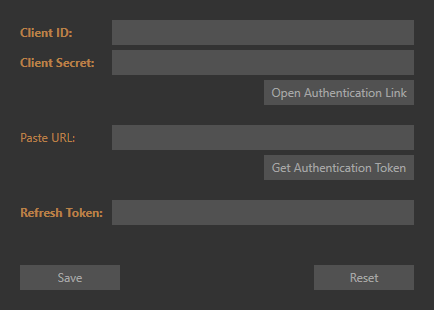
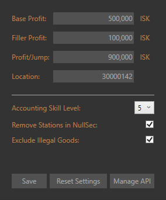

# EveMarketProphet (EMP)

Opportunistic trading tool for EVE Online. 
Calculates lucrative trade routes between market regions based on player location, cargo space, capital and configurable thresholds.
Uses live market data via CREST API. Windows WPF application.

# Setup

1. Unzip EMP
2. Unzip ```sqlite-latest.sqlite``` from [Fuzzwork SDE](https://www.fuzzwork.co.uk/dump/sqlite-latest.sqlite.bz2) to the ```Data\``` directory
3. Setup [CREST Authentication](#crest-authentication) **[recommended]**

## CREST Authentication

Reading the current player location, setting waypoints and opening market windows requires authentication via Single Sign-On (SSO).
Setting it up takes less than 5 minutes and enhances the usability of EMP greatly.
To learn more about SSO and CREST authentication visit the [EVE Online 3rd Party Developer Documentation](https://eveonline-third-party-documentation.readthedocs.io/en/latest/sso/index.html).

1. Create a new app via [EVE Online developer portal](https://developers.eveonline.com/applications)
2. Fill in the following information:

 **Name** | **Description** | **Connection Type** | **Permissions** | **Callback URL**
------------ | ------------- | -------------| -------------| -------------
YourName_EMP | EMP  | Authenticated API Access | characterLocationRead, remoteClientUI, characterNavigationWrite | /

3. View the newly created app, noting down ```Client ID``` and ```Secret Key```
4. Open EMP and go to **Settings - Manage API**



5. Copy the values from 3. and click **Open Authentication Link**
6. Login with your EVE credentials and select the character to use EMP with
7. Copy the response URL (the page you landed on after login) from your browser into **Paste URL** (make sure it is complete)
8. Click **Get Authentication Token**
9. If successful, a **Refresh Token** will be created
10. Hit **Save**


# User Guide

## Workflow


The toolbar is split into logical sections for common settings, actions, filtering and options. 
Going over each element from left-to-right will guide you through the general workflow.

Although not strictly necessary before fetching the live market data, it makes sense to make a mental note of the common settings first and change them according to the trade you want to make - be it in a fast ship, blockade runner or freighter.

Settings are stored on every application exit or manually via the **Settings** window.
Most settings can be changed after fetching the market data to then recalculate routes with new parameters (see [Options](#options)).

The general workflow is thus:

1. Check (and alter common) settings
2. Select a region preset from the dropdown and click **Fetch Data**
3. Click **Find Routes** to calculate profitable trips
4. Review trips, select one to run _OR_ change settings and repeat 3.
5. No good trips? Go to 2. and widen the search with a different preset

Theoretically, you can just use **Find Routes** again after completing a trip, thus calculating all available trade routes based on your new location.
Due to the short time necessary to download the market data, I recommend to always do a **Fetch Data** first.
EMP respects the rate limiting of the CREST API, so you don't have to worry about it.

To give you and idea on the numbers, it takes roughly 20 seconds to fetch all market data from the 4 biggest market regions (see [Region Presets](#region-presets)) and 4-8 seconds to calculate the routes (depending on your settings).
These numbers are heavily dependent on your machine and internet connection.

## Region Presets

Currently there are 3 presets:

 * **Hubs Main:** The Forge, Domain, Heimatar, Sinq-Laison
 * **Hubs All:** Hubs Main + Metropolis, Essence, Tash-Murkon, Khanid
 * **All:** All regions excluding WH-Space

## Trip


A trip is a single trade route between two stations, with one or many transactions.

The common starting location of all transactions does not have to be equal to your current player location. 
The jump diagram shows all waypoints, including the way to the starting location. 

_Hovering over individual dots will show the system name with security status and the overall jumps for the trip._
_Hovering over the station names will also show their security status._

In this example, a particular trip between Hek and Jita has the following attributes:

* **Profit / Jump:** 4.2m ISK
* **Trip Profit:** 78.4m ISK
* **Trip Cost:** 521.6m ISK
* **Trip Weight:** 12.6k m3

The **From** and **To** buttons will set the appropiate waypoints ingame, holding shift while clicking will add the waypoints without clearing existing ones.
Keep in mind that your ingame settings for safer/faster routes still applies, so you may need to change it.

**Filter** shows trips with common starting and ending _systems_, to better plan round-trips.
The **Clear Filter** button in the toolbar will remove the filtering.


## Transaction


A transaction is based on a pair of buy- and sell-orders between two stations of one particular item type.
Sometimes they are split up to denote different sell orders with individual prices to fulfill a single buy order at the target location.

In this example, 2 units of _'Augmented' Hammerhead_ are being sold for 34m ISK each, while 19 units are bought at the target location for 42.1m ISK each. 
The quantity of the transaction is 2, although we could have made a potential bigger profit.

This transaction with 2 units weighs in at 20m3. _Hovering over the field will show the individual type weight._

The total cost or investment for this trade comes in at 68m ISK, while the overall profit sums up to 15.4m ISK.

_Clicking on the type icon will open the associated market window ingame, when CREST authentication is configured correctly._


## Options



* **Base Profit:** Earliest threshold in the computation, base profit for the transaction without jumps, takes quantity into account
* **Filler Profit:** Prevents filling the cargo with miniscule amounts of low volume goods, settings lower than Base Profit have no effect
* **Profit/Jump:** Base profit per jump between two stations for a trip, not including the route to the start of the trip, filters out trips before expensive route finding
* **Location:** Fallback ```SolarSystemID``` for the player location, when offline or not using authenticated CREST, basis to route and calculate profitable trips
* **Accounting:** Level 5 of the Accounting skill lowers the tax rate from 2% to 1% and is important for profit calculations, applies to sell orders
* **Stations in NullSec:** Removes stations in 0.0 and lower from the dataset, AFAIK there is currently no way to check if a station is NPC-operated. When leaving this option on, you may not be able to dock there. **[Applies to next Fetch Data]**
* **Illegal Goods:** Removes illegal goods from the dataset, does not take regional differences into account **[Applies to next Fetch Data]**

# Caveats

With everything in EVE Online be suspicious and mindful. If a deal looks too good to be true, it probably is a scam or market scheme.
Buy orders can simply fail or be already fulfilled once you reach your destination.

Keep in mind that although rare, EMP does support minimum buyouts. Be careful when skipping sell orders that are listed to complete the buyout.

There are currently no safe-guards in place to filter out suspicious transactions with abnormal margins.

I am not responsible if you miss out on a big deal, get blown up with valuable cargo or tricked by market manipulation / sophisticated honey pots for traders.

Fly safe. Trade safe.

# FAQ

## Q: Is there any way around setting up my own app via the dev portal?
No. Sharing my personal ```Client ID``` / ```Secret Key``` would enable people to use the API in a potential malicous way and get my account banned.

## Q: Why are the ```Secret Key``` and ```Refresh Token``` not encrypted?
It wouldn't add much security, for the amount of extra overhead and key management. You have full control over the entire authentication process.
You can always change or add apps via the dev portal and create a new key. An attacker would need access to your system to get ahold of your Authentication.settings file and even then would be limited by the permission scope (location, waypoints, ui).

More information in the documentation for [EVE SSO Non-Browser Apps](https://eveonline-third-party-documentation.readthedocs.io/en/latest/sso/nonbrowserapps.html).

In short, the authentication flow and security measures differ greatly between a web-based application serving many users and a desktop application with a personal key.

## Q: What about the Broker Fee?
This style of opportunistic trading is all about the instant profit and therefor you will rarely setup long-term sell orders. Especially when travelling to far out systems, where you can't update the market orders easily.

# Frameworks

* [EveLib.NET [_EveLib.Auth_]](https://github.com/ezet/evelib)
* [QuickGraph](https://github.com/YaccConstructor/QuickGraph) 
* [Entity Framework Core](https://github.com/aspnet/EntityFramework)
* [ZXing.Net](https://zxingnet.codeplex.com/)
* [Json.NET](http://www.newtonsoft.com/json)
* [Prism [_Core_]](https://github.com/PrismLibrary/)
* [SQLite](https://sqlite.org/)
* [RateGate](http://www.jackleitch.net/2010/10/better-rate-limiting-with-dot-net/) 
* [GitVersion](https://github.com/GitTools/GitVersion)

# Credits

* Title & Logo Concept by **NNowheremaNN**
* Feedback & Ideas by **Pallustris**
* Pulse Icon by **Ho Thi Ngoc Trinh** (CC)
* Type Icons & Game Data by **CCP hf**
* **NavBot** & **EveNav** for Inspiration
* SDE SQLite conversion by **Fuzzwork**

# Donations

**Send ISK to:** ```Cindril```

**Bitcoin:** ```1DppXkNfPKbs1JiF2vZ3m89QQKnToPAuMZ```

[](https://www.paypal.com/cgi-bin/webscr?cmd=_s-xclick&hosted_button_id=SE7KHFVJ2UHQ4)

